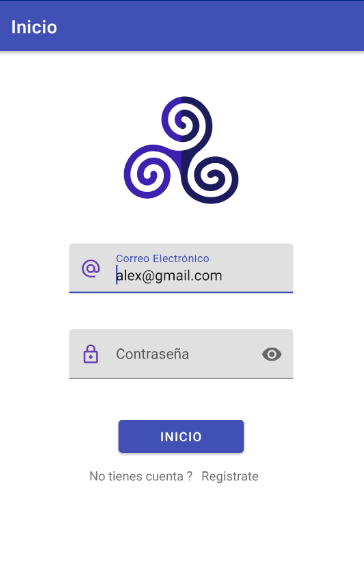
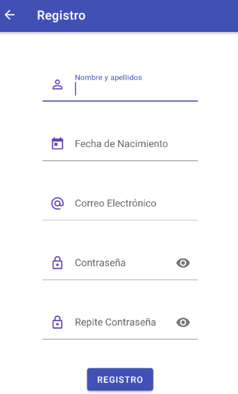
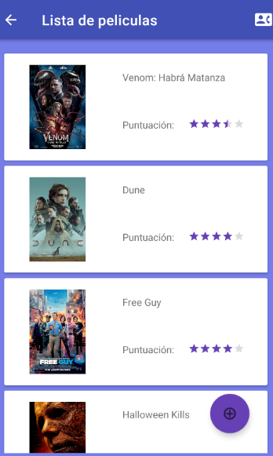
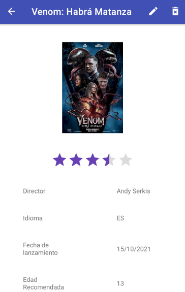

# Project PMDM
Project realized during the 2º year of Certificate of Higher Education in multiplatform coding
The project was oriented to creating a usual login/register application with a list that has
modification features in this case
i created a films app where you can save/edit your films this
app was working against an Api that our teacher created for this project.

## Login Screen

I made a simple design, the validation process works against the teachers api.
The login also has a link to the register screen

## Register Screen

Again a simple design, the register validation also works against the api.
From the register you can go back to the login.

## List Screen

This screen has a list of the films if you click any of the images it opens a more detailed
screen of the film. From this screen you can also create new films clicking the round floating
button and call the 'support' if you have problems with the app.

## Detail Screen

This screen has the more detailed view of the film. Here you can edit the film clicking on the
pencil icon or delete the film with the trash icon.